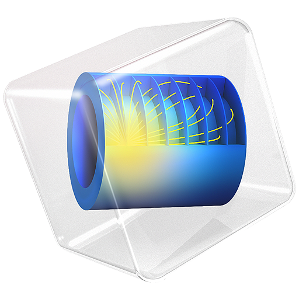

<h1 align="center">Hi 👋, I'm Anhad Mehrotra</h1>
<h3 align="center">AI/ML Enthusiast | Researcher | Problem Solver</h3>

 

 
  

- Final-year **B.Tech student** at **Cluster Innovation Centre**, University of Delhi, specializing in **Information Technology and Mathematical Innovations**.  
- Passionate about **Artificial Intelligence, Machine Learning, Computer Vision, and NLP**.  
- Experienced in **deep learning pipelines, semantic search, image segmentation, IoT**, and **Agentic AI systems**.  
- Always excited to collaborate on projects that **apply AI to real-world challenges** and push the boundaries of research.  
- Reach me at **anhad01mehrotra@gmail.com**  

<h3 align="left">Languages and Tools:</h3>

 
 
 
 
 

 
 
 
 
 

---

